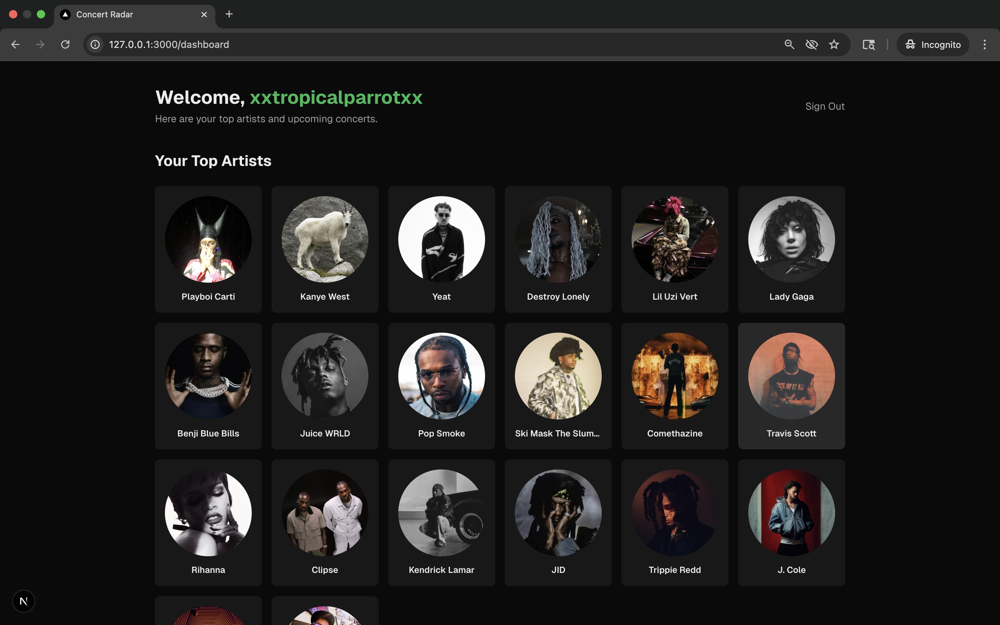
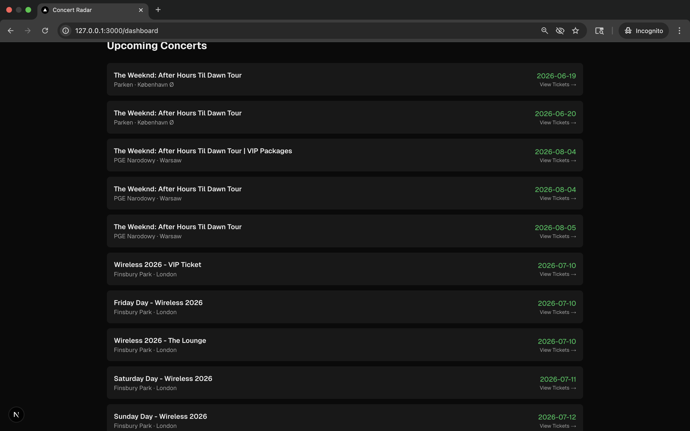
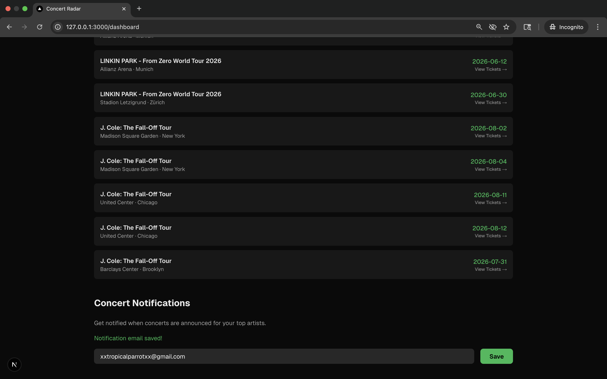

# Concert Radar

Find upcoming concerts from your favorite Spotify artists, with ticket links and email notifications.



## Features

- **Spotify Integration** — Connect your Spotify account to automatically pull your most-listened-to artists
- **Concert Discovery** — Searches Ticketmaster for upcoming concerts by your top artists
- **Email Notifications** — Opt in to receive email alerts when concerts are found for your artists
- **Redis Caching** — API responses cached for 6 hours, reducing response times by 97%
- **Persistent Storage** — User data, artists, and concerts stored in PostgreSQL

## Tech Stack

- **Frontend:** Next.js, TypeScript, Tailwind CSS
- **Authentication:** NextAuth.js with Spotify OAuth
- **Database:** PostgreSQL (Neon) with Prisma ORM
- **Caching:** Redis (Upstash)
- **APIs:** Spotify Web API, Ticketmaster Discovery API
- **Email:** Resend
- **Deployment:** Vercel

## Architecture

```
Browser → Next.js API Routes → Spotify / Ticketmaster APIs
                ↓
           Redis Cache
                ↓
        PostgreSQL Database
                ↓
           Resend Email
```

### Data Flow

1. User authenticates via Spotify OAuth
2. App fetches user's top artists from Spotify API
3. Artist names are searched against Ticketmaster for upcoming concerts
4. Results are cached in Redis (6-hour TTL) and persisted in PostgreSQL
5. Users can opt in to email notifications for new concerts

## Getting Started

### Prerequisites

- Node.js 18+
- Spotify Developer Account
- Ticketmaster API Key
- Neon PostgreSQL Database
- Upstash Redis Instance
- Resend API Key

### Setup

1. Clone the repository

```bash
git clone https://github.com/jadenw1023/concert-radar.git
cd concert-radar
```

2. Install dependencies

```bash
npm install
```

3. Create `.env.local` with your credentials

```
SPOTIFY_CLIENT_ID=your_spotify_client_id
SPOTIFY_CLIENT_SECRET=your_spotify_client_secret
NEXTAUTH_SECRET=your_nextauth_secret
NEXTAUTH_URL=http://127.0.0.1:3000
TICKETMASTER_API_KEY=your_ticketmaster_key
UPSTASH_REDIS_REST_URL=your_redis_url
UPSTASH_REDIS_REST_TOKEN=your_redis_token
RESEND_API_KEY=your_resend_key
```

4. Create `.env` with your database URL

```
DATABASE_URL=your_neon_connection_string
```

5. Run database migrations

```bash
npx prisma migrate dev
```

6. Start the development server

```bash
npm run dev
```

Visit `http://127.0.0.1:3000`

## Screenshots

### Top Artists


### Upcoming Concerts



### Email Notifications



## Technical Decisions

- **Next.js API Routes over separate backend** — The app is primarily API orchestration with light business logic; serverless functions handle this efficiently without managing a dedicated server
- **Redis caching** — Spotify and Ticketmaster have strict rate limits; caching reduces API calls by ~97% and drops response times from 1700ms to ~40ms
- **Cascade deletes** — Database relationships use cascade deletion to maintain referential integrity when refreshing artist data
- **Automatic token refresh** — Spotify access tokens expire hourly; the JWT callback automatically refreshes them using the stored refresh token

## Known Limitations

- Spotify Developer Mode limits the app to 5 authorized test users
- Ticketmaster keyword search can return loosely matched results (e.g., "Pop Smoke" matching "Blackberry Smoke")
- Concert notifications are sent daily at 9:00 AM UTC via Vercel Cron Jobs